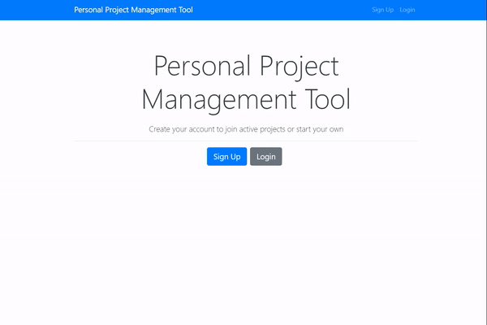
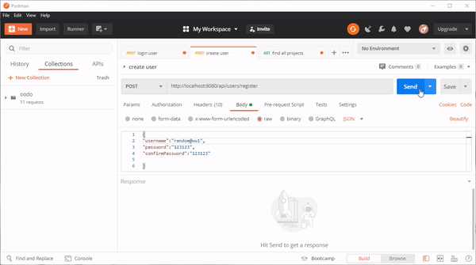

# Oodo 

Trello style todo list with JWT authorization and database support. Backend part done using **Spring framework**. Frontend done i **React** with Redux as state managment.
Main program structure was folowed with Udemy course. Some functionalities added later (Oauth2, drag and drop).

---
## Compleated functionalities
- JWT authentication

- database suppoty for users and tasks
- drag and drop on task list (trello style)
- custom error handling

---
## Todo
- finish Oauth authorization
- implement saving task movements between the columns

---
